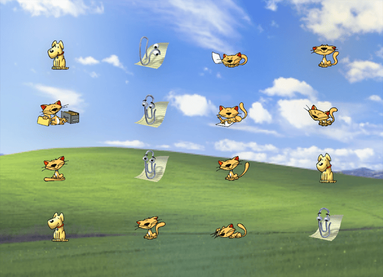

# clippy-js



Browser and React player for the Clippy, Cat, and Rocky sprite atlases from `clippy-swift`.

## Install

```bash
pnpm install
pnpm build
pnpm demo
```

## React

```tsx
import { useRef } from 'react'
import {
  AssistantSprite,
  ClippyAnimation,
  type AssistantSpriteHandle
} from 'clippy-js'

export function Demo() {
  const assistantRef = useRef<AssistantSpriteHandle>(null)

  return (
    <>
      <AssistantSprite
        ref={assistantRef}
        character="clippy"
        animation={ClippyAnimation.idleSideToSide}
        scale={2}
        style={{ position: 'fixed', right: 24, bottom: 24 }}
      />

      <button
        onClick={() => {
          void assistantRef.current?.play(ClippyAnimation.wave, { loop: false })
        }}
      >
        Wave
      </button>
    </>
  )
}
```

## Headless canvas

```ts
import { createAssistantPlayer, RockyAnimation } from 'clippy-js'

const player = createAssistantPlayer({ character: 'rocky' })
player.attach(document.querySelector('canvas')!)
await player.play(RockyAnimation.greeting)
```

## Asset sync

`pnpm generate` copies the current atlases and manifests from `../clippy-swift/Sources/ClippySwift/Resources`.

## Demo site

```bash
pnpm demo
pnpm demo:build
```

The demo renders nine assistants across a full-screen 3x3 stage.
